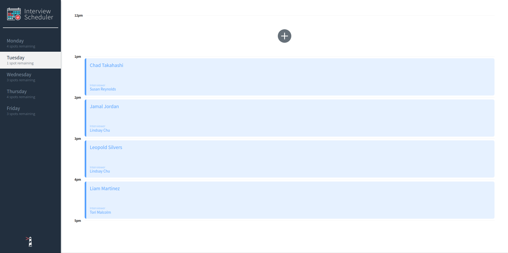
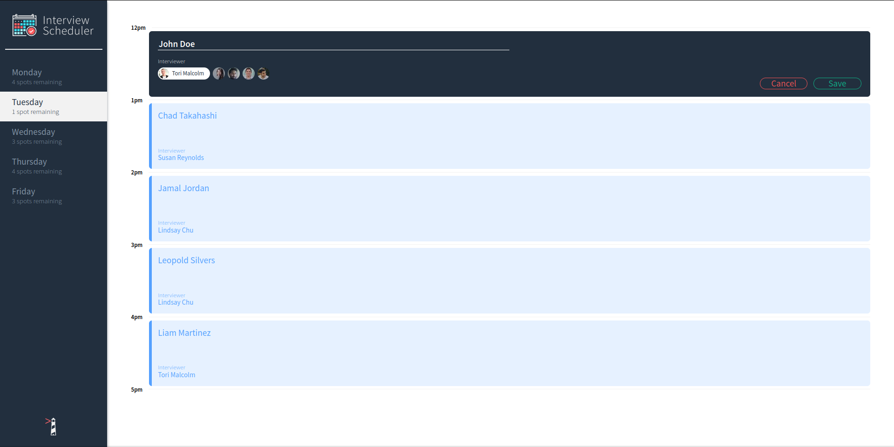
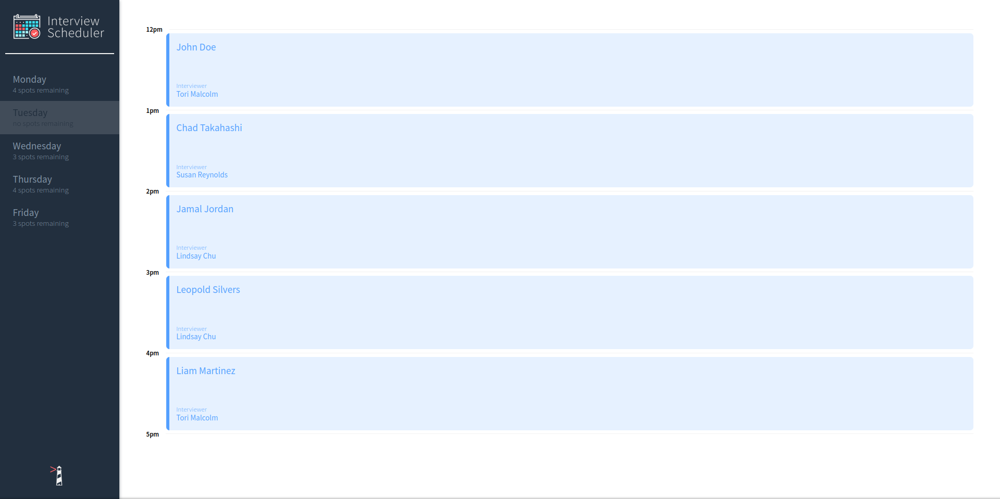
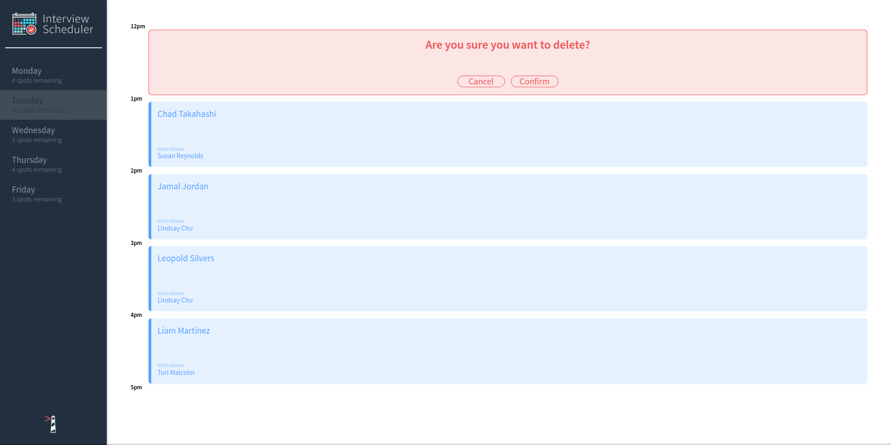

# Interview Scheduler

## Screenshots





## Setup

Install dependencies with `npm install`.

## Running Webpack Development Server

```sh
npm start
```

## Running Jest Test Framework

```sh
npm test
```

## Running Storybook Visual Testbed

```sh
npm run storybook
```

## Run

`npm start`

# In a new terminal..

Clone scheduler-api from `https://github.com/lighthouse-labs/scheduler-api`

`git clone https://github.com/lighthouse-labs/scheduler-api`

`cd scheduler-api`

`npm install`

Follow the [readme](https://github.com/lighthouse-labs/scheduler-api/blob/master/README.md) instructions..

`npm start`
